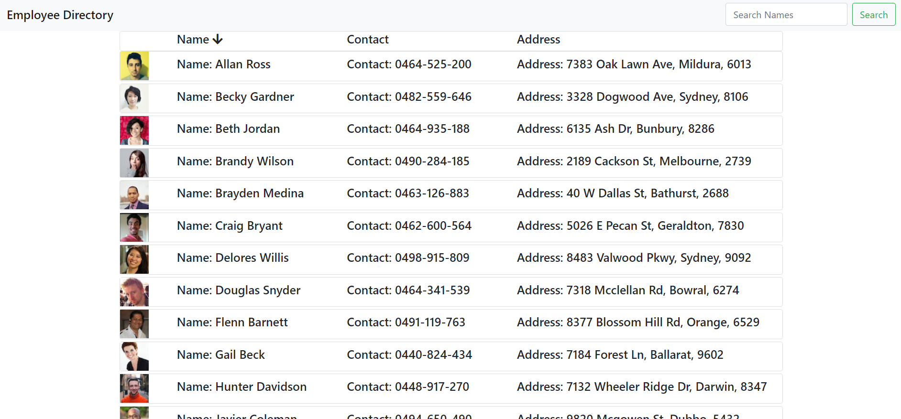

# Employee Directory (React)
### By trojanface

## Description
An employee directory that uses an API to populate a list and search/sort functions to arrange that list on the screen.

## Link to Deployed App
https://fe

## Installation
1. Clone project
2. Npm install
3. Npm start

OR

View deployed app at previously mentioned deployed link

## Usage
1. Click on name column to sort employees by name alphabetically.
2. Type a whole or partial name in search box to search the list for a particular employee.

## License
Public Domain

